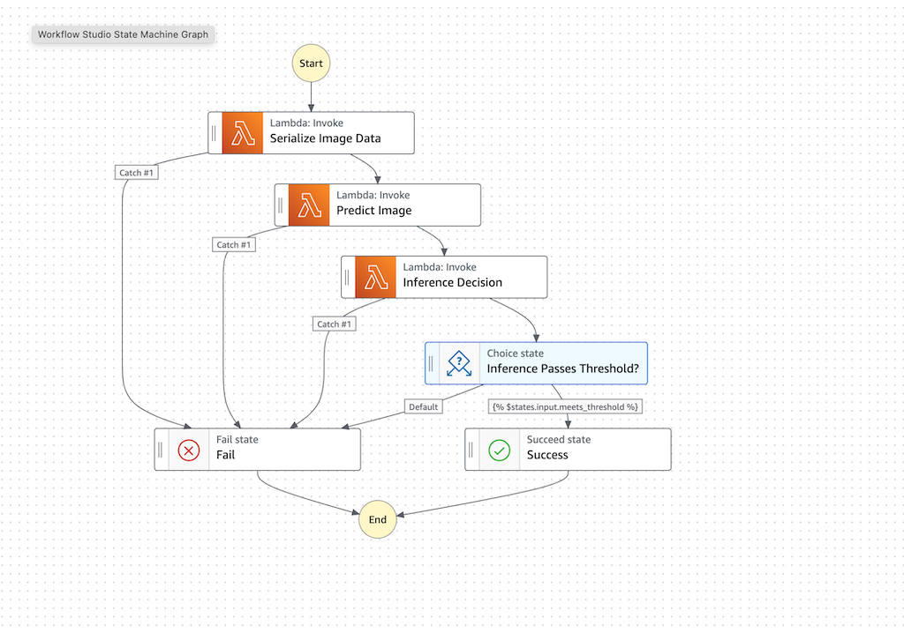
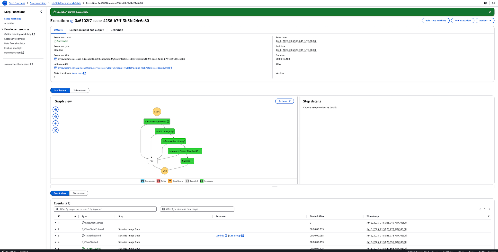
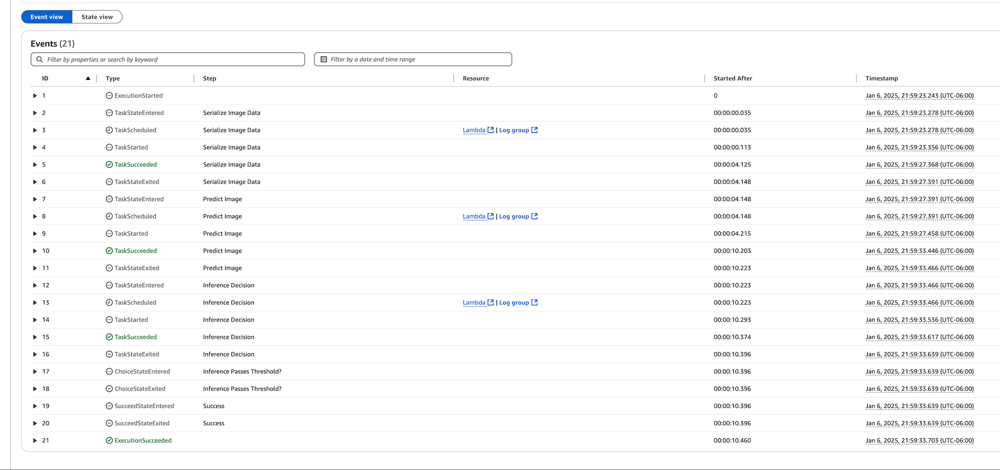

# Udacity-Developing-Your-First-ML-Workflow

This is the Github repo for Udacity Developing your first ML workflow course. This repo contains the code for demos, exercises and the final project,

# Submission Notes

## Train and Deploy a Machine Learning Model

The submission project files of relevance can be found in the following locations:

- [/project/starter.ipynb](./project/starter.ipynb)
  - contains all ETL, model training and endpoint creation in the notebook
  - also contains model evaluation/monitoring visualizations and processing of monitoring data steps
- [/project/lambda.py](./project/lambda.py)
  - contains all three lambda functions
- [/project/step_function_definition.json](./project/step_function_definition.json)
  - contains the json definition of the step function connecting the 3 lambda functions

## Step Function Screenshots

## Challenges

Recent updates to the AWS ecosystem led to some challenges in getting the Lambda functions to work properly. This led to a period of troubleshooting runtime packages that were incompatible with the available runtime environments. This project was completed using the latest Sagemaker studio, though I had to downgrade multiple version of the sagemaker sdk in order to get a functional Lambda runtime environment. The lambda functions were deployed on Python 3.9, with a bit of trial and error to get the correct packages together.
